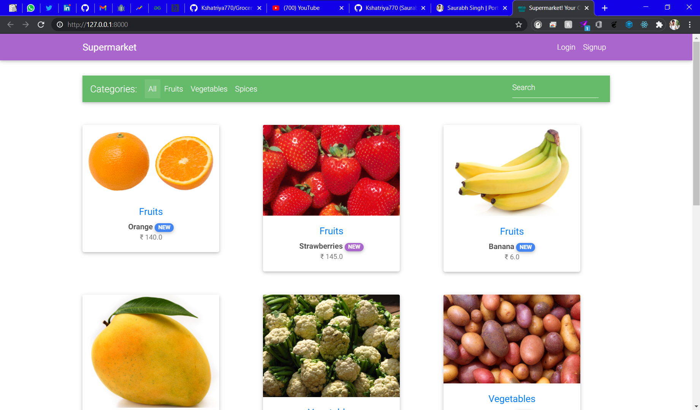
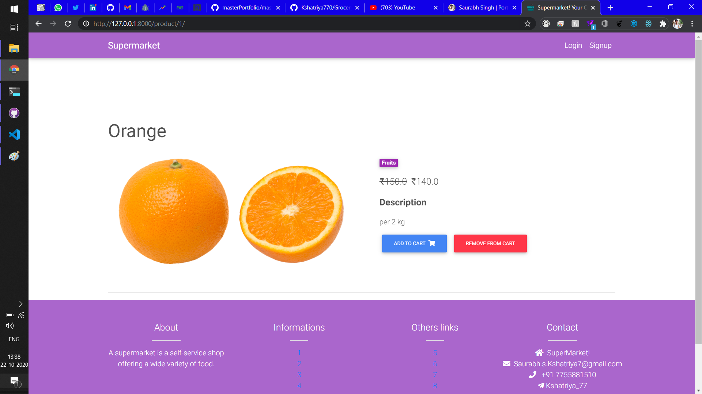
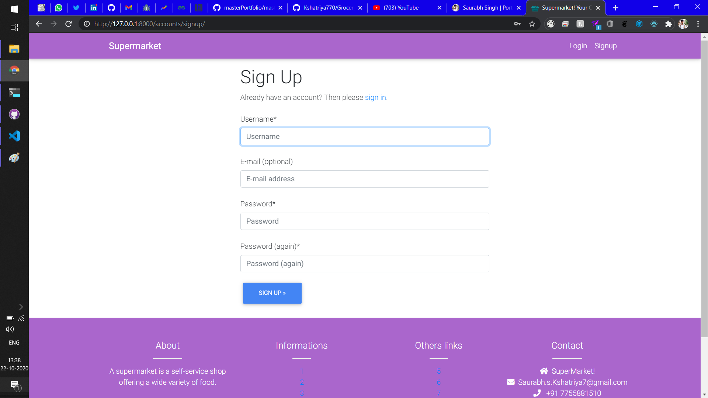
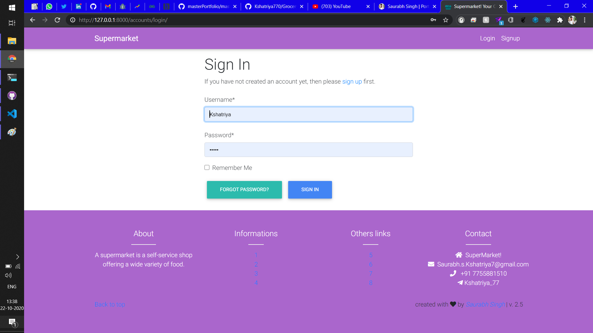
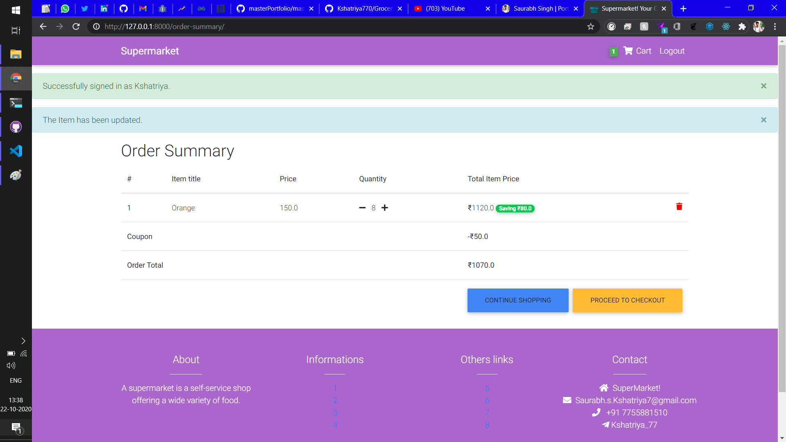
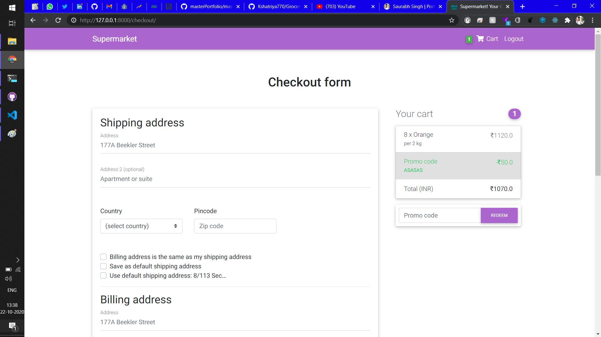
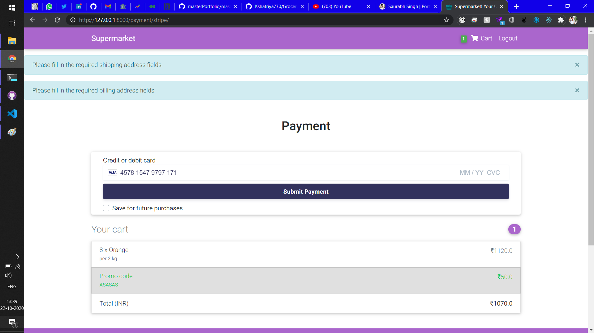

<h1 align="center"> Grocery Store🔥 </h1> 
<h3 align="center"> A clean, beautiful, responsive and 100% customizable E-Commerce Store made on Python/Django </h3>
<br>
<p align="center"> 
    <a href="https://github.com/Kshatriya770/Grocery-Store/blob/master/images/frontimage.png" target="_blank">
    
  </a>
</p>

:star: Star this Project on GitHub — it helps!

# Sections 📚

✔️ Beautiful Login Page \
✔️ Forgot Password help \
✔️ Inbuilt Database \
✔️ no server required for running\
✔️ You can add your own Database like `sql`, `mysql` etc 🏆\
✔️ Contact me for for any help setting this up \
✔️ More Screenshots at the Bottom... \

# Clone And Use 📋

- The website is completely built on `django` framework of `python` and that's why we need `python` and `pip` installed.
- While installing `python`, try to install version `3.7+` which are equal or greater than the versions mentioned and make sure `pip` is installed along side with it You can check boxes for installing `pip` while installing `python`.
- In case you want to help developing it or simply saving it, you can fork the repository just by clicking the button on the top-right corner of this page.
- After the successful installation of `python`, clone the repository into your local system using below command:
  - ```python
     git clone https://github.com/Kshatriya770/Grocery-Store.git
    ```
  - This will clone the whole repository in your system.
- To download required dependencies to your system, navigate to the directory where the cloned repository resides and execute following command:
  - ```python
    pip install -r requirements.txt
    ```
- Some of the required dependencies will be downloaded to your system.
- Now, the project is ready to use.
- You can check it using `python manage.py runserver`, it will open the website locally on your browser.(create issue or let me know if anything happens with the SECRET KEY).
- To manage the Database you need to create a admin.
- To do so go to terminal in the directory and execute this command:
  - ```python
     python manage.py createsuperuser
    ```
-  You need to fill the `Username`, `Email` and `Password`
    - superuser created successfully
- Now, Navigate to `127.0.0.1:8000/admin` to manage Database.

- That's it, Now it's Yours. 
- Don't forget to add features and create a Pull request to this Project. Enjoy your Day!

# Technologies used 🛠️

- [Python](https://python.org/)
- [HTML](https://www.w3schools.com/html/)
- [CSS](https://www.w3schools.com/css/)
- SCSS
- [JavaScript](https://www.javascript.com/)

# Screenshots 🌈

<p align="center"> 
    <a href="https://github.com/Kshatriya770/Grocery-Store/blob/master/images/productpage.png" target="_blank">
    
  </a>
</p>

<p align="center"> 
    <a href="https://github.com/Kshatriya770/Grocery-Store/blob/master/images/signin.png" target="_blank">
    
  </a>
</p>

<p align="center"> 
    <a href="https://github.com/Kshatriya770/Grocery-Store/blob/master/images/signup.png" target="_blank">
    
  </a>
</p>

<p align="center"> 
    <a href="https://github.com/Kshatriya770/Grocery-Store/blob/master/images/cart.png" target="_blank">
    
  </a>
</p>

<p align="center"> 
    <a href="https://github.com/Kshatriya770/Grocery-Store/blob/master/images/address.png" target="_blank">
    
  </a>
</p>

<p align="center"> 
    <a href="https://github.com/Kshatriya770/Grocery-Store/blob/master/images/payment.png" target="_blank">
    
  </a>
</p>